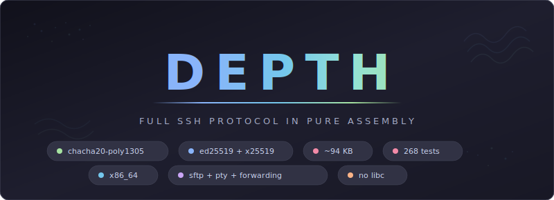

<div align="center">



<br>

Depth is a complete SSH-2.0 protocol implementation written entirely in x86_64 NASM assembly. A ~94 KB statically-linked ELF binary handles key exchange (Curve25519), host authentication (Ed25519), encrypted transport (ChaCha20-Poly1305), interactive shells (PTY), remote command execution, SFTP file transfers, and TCP port forwarding — all built from scratch with pure Linux syscalls, zero libc, zero dependencies.

</div>

<br>

## Table of Contents

- [Highlights](#highlights)
- [Quick Start](#quick-start)
- [Architecture](#architecture)
- [Configuration](#configuration)
- [Wire Protocol](#wire-protocol)
- [Internals](#internals)
- [Testing](#testing)
- [Project Structure](#project-structure)
- [Future Work](#future-work)

---

## Highlights

<table>
<tr>
<td width="50%">

### ChaCha20-Poly1305 AEAD
Full `chacha20-poly1305@openssh.com` transport encryption. Two-key scheme: K1 encrypts payload (counter=1), K2 encrypts packet length (counter=0). Sequence-number nonce. Every packet authenticated — tampered data rejected before decryption.

</td>
<td width="50%">

### Ed25519 + X25519
Complete elliptic curve cryptography from scratch. X25519 Diffie-Hellman for key exchange, Ed25519 for host key signatures. SHA-512 for Ed25519 internals, SHA-256 for exchange hash. All field arithmetic in pure assembly.

</td>
</tr>
<tr>
<td width="50%">

### Full SSH Protocol Stack
RFC 4253/4254 compliant: version exchange, algorithm negotiation (KEXINIT), ECDH key exchange, NEWKEYS, service request, password authentication, channel multiplexing (up to 8 concurrent), PTY allocation, shell/exec requests, window management.

</td>
<td width="50%">

### ~94 KB Static Binary
The entire implementation — crypto primitives, SSH protocol, PTY handling, SFTP, port forwarding, TLS 1.3 — compiles to a ~94 KB statically-linked ELF. No libc, no dynamic linking, no runtime dependencies. Pure Linux syscalls via `syscall` instruction.

</td>
</tr>
<tr>
<td width="50%">

### SFTP File Transfers
Full SFTPv3 implementation: open, read, write, close, stat, fstat, lstat, setstat, opendir, readdir, remove, mkdir, rmdir, rename, realpath. Handles concurrent shell + SFTP sessions through event-loop integration.

</td>
<td width="50%">

### TCP Port Forwarding
Both local (`ssh -L`) and remote (`ssh -R`) forwarding. Direct-tcpip channels for local forward, global request handling for remote forward with accept loop and forwarded-tcpip channel opens. Multiplexed alongside shell/SFTP channels.

</td>
</tr>
<tr>
<td width="50%">

### Interactive PTY Shell
Full pseudoterminal support via `/dev/ptmx`: allocate master/slave pair, fork, setsid, set controlling terminal, dup2 stdio, execve `/bin/bash`. Poll-based I/O relay between PTY master and SSH channel with child process lifecycle management.

</td>
<td width="50%">

### Pipe-Based Command Execution
Non-interactive `ssh target 'cmd'` without PTY. Creates stdin/stdout pipes, forks, executes via `bash -c`. Graceful EOF handling: close stdin pipe to signal child, drain buffered output, wait for natural exit with SIGKILL fallback.

</td>
</tr>
</table>

---

## Quick Start

### Prerequisites

| Requirement | Version |
|-------------|---------|
| NASM | Latest |
| GNU ld | Any (static linking) |
| GCC | Any (for `sc_reduce_c.c` helper) |
| Python | >= 3.8 (for tests) |
| pytest | `pip install pytest` |
| cryptography | `pip install cryptography` |

### Build & Run

```bash
# Clone
git clone https://github.com/Real-Fruit-Snacks/Depth.git
cd Depth

# Build everything (binary + all test harnesses)
make

# Run tests (268 tests)
make test

# Run the binary (bind mode, port 7777)
./build/depth

# Connect with OpenSSH
ssh -p 7777 svc@target

# Non-interactive command execution
ssh -p 7777 svc@target 'whoami'

# SFTP
sftp -P 7777 svc@target

# Port forwarding
ssh -L 8080:internal:80 -p 7777 svc@target
```

### Configuration

Edit `include/config.inc` before building:

```nasm
server_ip:      dd 0x0100007F      ; 127.0.0.1 (network byte order)
server_port:    dw 0xBB01          ; port 443 (big-endian)
ssh_username:   db "svc"
ssh_password:   db "changeme"
bind_mode:      db 1               ; 0=reverse, 1=bind
bind_port:      dw 7777
```

---

## Architecture

```
[Operator]                              [Target]
 OpenSSH  ──────── TCP ──────────>   depth (bind mode)
          <── SSH-2.0 banner ────
          ── KEXINIT ───────────>
          <── KEXINIT ──────────
          ── ECDH_INIT ─────────>
          <── ECDH_REPLY ───────    (Ed25519 signed)
          ── NEWKEYS ───────────>
          <── NEWKEYS ──────────
          ══ encrypted channel ══>
          <══ encrypted channel ══
```

| Layer | Implementation |
|-------|----------------|
| **Transport** | Raw TCP via Linux syscalls (`socket`, `connect`, `bind`, `listen`, `accept`) |
| **Encryption** | `chacha20-poly1305@openssh.com` — two-key AEAD, sequence-number nonce |
| **Key Exchange** | Curve25519 ECDH (`curve25519-sha256`), SHA-256 exchange hash |
| **Host Auth** | Ed25519 signatures (`ssh-ed25519`), SHA-512 internals |
| **User Auth** | Password authentication (`ssh-userauth` service) |
| **Channels** | Up to 8 multiplexed channels with independent window management |
| **Shell** | PTY via `/dev/ptmx`, poll-based I/O relay, child lifecycle management |
| **Exec** | Pipe-based `bash -c` for non-interactive commands, stdout/stderr merged |
| **SFTP** | SFTPv3 with 16 file handle slots, event-loop integrated |
| **Forwarding** | Local (`direct-tcpip`) and remote (`tcpip-forward`) TCP forwarding |
| **TLS** | Optional TLS 1.3 wrapping (X25519 + ChaCha20-Poly1305) via I/O dispatch |
| **Key Derivation** | HKDF-SHA256 with RFC 4253 key derivation (A-F letters) |
| **MAC** | `hmac-sha2-256` advertised for compatibility (implicit with AEAD cipher) |

---

## Wire Protocol

### SSH Packet (Plaintext, Pre-NEWKEYS)

```
┌──────────────┬──────────┬───────────┬──────────┐
│ pkt_len (4B) │ pad (1B) │ payload   │ padding  │
│ big-endian   │          │           │ >= 4B    │
└──────────────┴──────────┴───────────┴──────────┘
   total = 4 + pkt_len, aligned to 8 bytes
```

### SSH Packet (Encrypted, Post-NEWKEYS)

```
┌──────────────────┬────────────────────────┬──────────┐
│ enc_length (4B)  │ enc_payload (N)        │ MAC (16B)│
│ K2 stream cipher │ K1 ChaCha20 ctr=1      │ Poly1305 │
└──────────────────┴────────────────────────┴──────────┘
  K2 encrypts length field (counter=0, seq as nonce)
  K1 encrypts padded payload (counter=1)
  Poly1305 key from K1 block 0
  MAC covers enc_length + enc_payload
```

### ECDH Key Exchange

```
Client                              Server
  │── SSH_MSG_KEX_ECDH_INIT ──────>│  (client ephemeral X25519 pub)
  │                                 │  compute shared secret
  │                                 │  compute exchange hash H
  │                                 │  sign H with Ed25519 host key
  │<── SSH_MSG_KEX_ECDH_REPLY ────│  (host pub + server ephem + signature)
  │  verify Ed25519 signature       │
  │  derive 6 session keys (A-F)    │  derive 6 session keys (A-F)
```

---

## Internals

### Crypto Primitives

All cryptography implemented from scratch in x86_64 assembly:

| Primitive | File | Description |
|-----------|------|-------------|
| SHA-256 | `sha256.asm` | FIPS 180-4, used for exchange hash and key derivation |
| SHA-512 | `sha512.asm` | Used internally by Ed25519 |
| X25519 | `curve25519.asm` | Curve25519 scalar multiplication for ECDH |
| Ed25519 | `ed25519.asm` | Edwards-curve signatures (sign + verify) |
| ChaCha20 | `ssh_aead.asm` | 20-round stream cipher, 256-bit key |
| Poly1305 | `ssh_aead.asm` | One-time MAC, mod 2^130-5 arithmetic |
| HMAC-SHA256 | `hmac_sha256.asm` | Used by HKDF for key derivation |
| HKDF | `hkdf.asm` | RFC 5869 extract-and-expand |

### Channel Multiplexing

Each channel occupies a 48-byte state structure:

| Offset | Field | Description |
|--------|-------|-------------|
| 0 | `LOCAL_ID` | Our channel number (0-7) |
| 4 | `REMOTE_ID` | Peer's channel number |
| 8 | `LOCAL_WINDOW` | Bytes we can still receive |
| 12 | `REMOTE_WINDOW` | Bytes we can still send |
| 16 | `LOCAL_MAXPKT` | Our max packet size |
| 20 | `REMOTE_MAXPKT` | Peer's max packet size |
| 24 | `WRITE_FD` | Write fd (PTY master or stdin pipe) |
| 28 | `CHILD_PID` | Shell/exec child process ID |
| 32 | `FLAGS` | Channel state flags |
| 36 | `TYPE` | 0=unused, 1=session, 2=direct-tcp, 3=sftp |
| 40 | `FD` | Read fd (PTY master or stdout pipe) |

### I/O Dispatch

Platform-agnostic I/O through function pointers:

```
io_read_fn  → net_read_exact  (raw TCP)
              tls_read_exact  (TLS 1.3 wrapped)

io_write_fn → net_write_all   (raw TCP)
              tls_write_all   (TLS 1.3 wrapped)
```

All SSH protocol code calls through `io_read_fn` / `io_write_fn`, enabling transparent TLS wrapping without modifying any protocol logic.

### Memory Layout

The v2 event loop allocates ~38 KB on the stack:

| Offset | Size | Purpose |
|--------|------|---------|
| `+0` | 32 KB | Receive/send buffer (encrypted packets) |
| `+32896` | 1 KB | Packet construction workspace |
| `+33920` | 104 B | pollfd array (13 entries: 1 ssh + 8 channels + 4 forwards) |
| `+34024` | 4 KB | I/O relay buffer |
| `+38128` | 16 B | PTY fd storage |

---

## Testing

### Test Suite (268 Tests)

| Category | Tests | Description |
|----------|-------|-------------|
| SHA-256 | 8 | NIST vectors, empty input, streaming, large data |
| SHA-512 | 6 | NIST vectors, empty input, large data |
| X25519 | 7 | RFC 7748 vectors, all-zero rejection, identity |
| Ed25519 | 9 | RFC 8032 vectors, sign/verify roundtrip, invalid signatures |
| HMAC-SHA256 | 6 | RFC 4231 vectors, key lengths |
| HKDF | 6 | RFC 5869 vectors, extract/expand |
| SSH Encode | 14 | mpint, string, uint32 encoding/decoding |
| SSH AEAD | 15 | Encrypt/decrypt roundtrip, MAC verification, tamper detection |
| SSH Transport | 24 | Packet framing, KEXINIT building, name-list parsing |
| SSH KEX | 8 | Client/server key exchange, shared secret derivation |
| SSH Auth | 10 | Password auth, none probe, multi-attempt |
| SSH Channel | 14 | Open/confirm, data transfer, window management, EOF/close |
| SSH PTY | 12 | PTY allocation, shell spawn, pipe exec (8 tests), relay |
| SSH E2E | 4 | Build verification, ELF validation, full session |
| SSH Multi-channel | 6 | Concurrent channels, independent data streams |
| SSH Forwarding | 10 | Local forward, direct-tcpip channels |
| Remote Forward | 5 | Remote forward setup, forwarded-tcpip |
| SFTP | 12 | File operations, directory listing, read/write |
| Bind Mode | 8 | Server-mode operation, accept loop |
| Master Socket | 5 | Connection multiplexing |
| TLS 1.3 | 4 | Handshake, encrypted SSH over TLS |
| SNI/ALPN | 2 | TLS server name indication |
| Stress | 53 | Rapid I/O, large transfers, concurrent operations |
| Pubkey Auth | 5 | Ed25519 public key authentication flow |

### Running Tests

```bash
# All tests
make test

# Specific category
python3 -m pytest tests/test_sha256.py -v
python3 -m pytest tests/test_ssh_pty.py::TestPipeExec -v

# Stress tests only
python3 -m pytest tests/test_ssh_stress.py -v
```

Each test category has a NASM test harness (`.asm`) that exposes assembly functions to a Python test runner (`.py`) via stdin/stdout binary protocol.

---

## Project Structure

```
Depth/
├── Makefile                # Build targets for binary + 22 test harnesses
├── src/
│   ├── main.asm            # Entry point: mode dispatch (bind/reverse)
│   ├── ssh_transport.asm   # Version exchange, KEXINIT, ECDH, key derivation
│   ├── ssh_auth.asm        # Password + pubkey authentication (client + server)
│   ├── ssh_channel.asm     # Channel multiplexing, window management
│   ├── ssh_client.asm      # v2 event loop: poll, dispatch, PTY/pipe relay
│   ├── ssh_pty.asm         # PTY allocation, shell/exec spawn, pipe exec
│   ├── ssh_sftp.asm        # SFTPv3 dispatch: 16 opcodes, handle table
│   ├── ssh_forward.asm     # Local port forwarding (direct-tcpip)
│   ├── ssh_remote_forward.asm  # Remote port forwarding (tcpip-forward)
│   ├── ssh_encode.asm      # SSH wire encoding: mpint, string, uint32
│   ├── ssh_aead.asm        # ChaCha20-Poly1305 AEAD encrypt/decrypt
│   ├── sha256.asm          # SHA-256 (FIPS 180-4)
│   ├── sha512.asm          # SHA-512 (for Ed25519)
│   ├── curve25519.asm      # X25519 scalar multiplication
│   ├── ed25519.asm         # Ed25519 sign + verify
│   ├── hmac_sha256.asm     # HMAC-SHA256
│   ├── hkdf.asm            # HKDF extract + expand
│   ├── net.asm             # TCP networking (socket, connect, bind, accept)
│   ├── io_dispatch.asm     # Function pointer I/O abstraction
│   ├── tls13.asm           # TLS 1.3 handshake
│   ├── tls_io.asm          # TLS record I/O
│   ├── tls_record.asm      # TLS record framing
│   └── sc_reduce_c.c       # Ed25519 scalar reduction (C helper)
├── include/
│   ├── ssh.inc             # SSH constants, channel state struct, SFTP types
│   ├── syscall.inc         # Linux syscall numbers
│   ├── config.inc          # IP, port, credentials, mode settings
│   ├── tls.inc             # TLS constants
│   ├── aead.inc            # AEAD constants
│   ├── chacha20.inc        # ChaCha20 constants
│   └── poly1305.inc        # Poly1305 constants
├── tests/                  # 25 NASM harnesses + 28 Python test runners
├── tools/
│   └── keygen.py           # Ed25519 keypair generator
└── docs/
    ├── index.html          # GitHub Pages landing page
    └── banner.svg          # Repository banner
```

---

## Future Work

- Exit status channel message (return real exit codes)
- Sequential bind-mode connections (accept loop after session ends)
- Terminal resize (SIGWINCH / window-change request)
- Rekey after data volume threshold
- Ed25519 public key authentication (live tested)
- Window adjust for large transfers
- Environment variable requests

---

<div align="center">

**Pure assembly. Full protocol. All the way down.**

*Depth — complete SSH-2.0 in ~94 KB of x86_64 NASM*

---

**For authorized use only.** This tool is intended for legitimate security research, authorized penetration testing, and educational purposes. Unauthorized access to computer systems is illegal. Users are solely responsible for ensuring compliance with all applicable laws and obtaining proper authorization before use.

</div>
